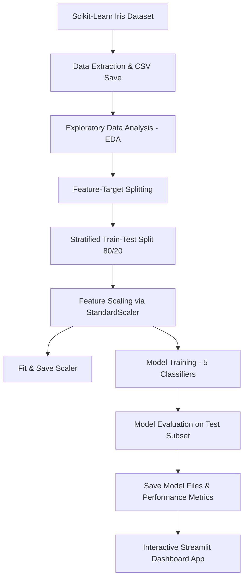

# iris-species-classifier
Iris flower species classification using Machine Learning with an interactive Streamlit dashboard." 🚀
## 🌟 Project Overview

This project implements a complete machine learning workflow to classify iris flowers into three distinct species:
1. **Iris Setosa**
2. **Iris Versicolor**
3. **Iris Virginica**

Using standard floral measurements—**Sepal Length**, **Sepal Width**, **Petal Length**, and **Petal Width**—the classification engine makes real-time predictions. The project showcases and compares five distinct supervised machine learning classification algorithms.

---

## 🚀 Key Features

*   **Multi-Model Engine:** Trains, compares, and evaluates 5 standard ML models:
    *   Logistic Regression
    *   K-Nearest Neighbors (KNN)
    *   Decision Tree Classifier
    *   Random Forest Classifier
    *   Support Vector Machine (SVM)
*   **Scientific Preprocessing:** Features feature standardization scaling pipeline (`StandardScaler`) to ensure accurate training across distance-based algorithms.
*   **Performance Analytics:** Detailed comparative metrics (Accuracy, Precision, Recall, F1-Score) and a composite Confusion Matrix showing the misclassification characteristics of all five models.
*   **Interactive Streamlit Web Dashboard:**
    *   **Live Prediction Tab:** Dynamic input sliders, real-time prediction updates, and full class probability breakdown graphs.
    *   **Botanical Profile Viewer:** Display of detailed botanical profiles and botanical watercolor illustrations of the predicted species.
    *   **Model Performance Tab:** Side-by-side model comparison tables and pre-rendered seaborn visualization graphics.
    *   **EDA Tab:** Deep dive into dataset correlations, pair-plots, feature distributions, and raw dataset interactive explorer.
*   **AI-Generated Graphics:** Custom scientific illustrations for the iris species.

---

## 🛠️ Tech Stack & Libraries

*   **Language:** Python 3.9+
*   **Data Analysis:** `pandas`, `numpy`
*   **Machine Learning:** `scikit-learn` (Scikit-Learn)
*   **Model Export:** `joblib`
*   **Visualization:** `matplotlib`, `seaborn`
*   **Web Framework:** `streamlit`
*   **Image Processing:** `pillow`

---

## 📊 Machine Learning Pipeline

The project follows a standard professional ML engineering workflow:



---

## ⚙️ Installation & Setup

Ensure Python 3.8+ is installed on your local system.

### 1. Clone or Download Project
Place the project files in your workspace directory:
```bash
cd iris-flower-classification
```

### 2. Create and Activate Virtual Environment (Recommended)
```bash
# Windows
python -m venv venv
venv\Scripts\activate

# macOS/Linux
python3 -m venv venv
source venv/bin/activate
```

### 3. Install Dependencies
```bash
pip install -r requirements.txt
```

---

## 💻 How to Run the Project

### Step 1: Execute Model Training Pipeline
Run the model training script to process the dataset, perform EDA, train the 5 classification models, and output performance plots:
```bash
python model_training.py
```
This script will output the performance metrics table in your console and save the trained models in the `models/` directory and visual assets in the `images/` directory.

### Step 2: Launch the Streamlit App
Launch the interactive web-based dashboard application:
```bash
streamlit run app.py
```
The application will automatically open in a new browser tab (usually at `http://localhost:8501`).

---

## 📸 Screenshots & Visualizations

### 1. Model Prediction & Botanical Profile
*Displays slider adjustments, live species classification, confidence progress bars, and the botanical watercolor illustration.*

### 2. Model Performance Dashboard
*Presents the evaluation tables and comparative charts like accuracy bars and confusion matrix heatmaps.*

### 3. Exploratory Data Analysis
*Examines pairwise feature plots, correlation heatmaps, and distribution graphs.*

